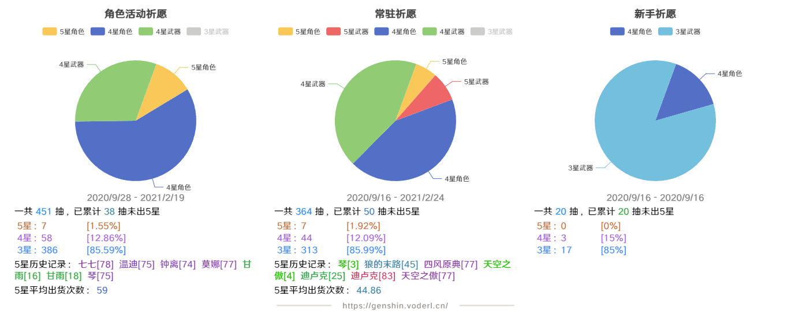
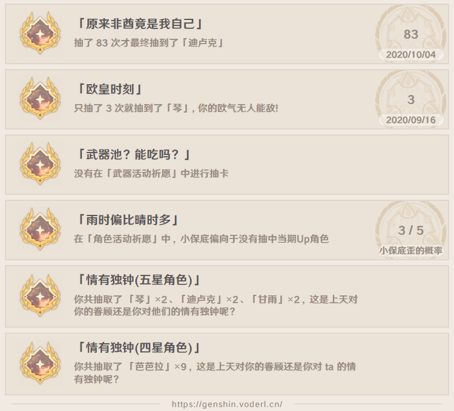
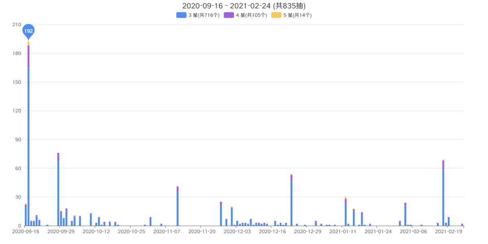

# Genshin Wish Analyzer | 原神抽卡记录分析工具

中文 | [English](./docs/README_EN.md)

## Demo
[Demo 点击前往](https://genshin.voderl.cn/#=Nn76tHK~f4mENVDRCxCg6TXdXqdUc5sOOMtsENKCoQlio2YT6lUK2qJvH811r21Ja7GdCEGLUu52bkhPmJzKWbkLB6YI5rFzNWniO7xx7YpbuJRbjzcWpPJm31WtcVHbZOl8Xx7thl97KPgrlZuKDorp5GSVZ6jxDoSc6FyILedBa2fiNTlQmnyI5S~WSEk7a3xpZd8DrZvO889y08Qnk4HOkplTEGUYpCSUg428JfPKOWtzJV1ROKsnHp1VfISKErUpjm1qZH8QbkIurg7Fn7bMqkg7TEKP0KN9oS4yldQUeopH0lmDYvUwatZUr7W5yy~cNX3TIOc7VJdtNcNO~7OnIic6bxs0bjAteOUoiDrNju5YW4UD6q33UZZDm1TYsUZx8u=ZSmMysHKWf0kQZyG8eO~~nxJ6z1bC9VUaPSyNPKjF4bDGJ56pTWp9R=TJMUpPNZ=1xg6USkdhqXQiyf3WIT1LBHky56oHn2PhfKKEyCesKHlDJLyU=g7l8xwwkJ1DWRWa7Wilh0Mk2OklbRJ~niP6OaVuMkpq=JRYpCTDqkl1JFLi4A1D61NsXXkFG1RdCnGbVQFEkbtVCg=j6erOZNoSLoMtSIkqhJUqpKmW=2ti8xr2oyiObdSFtBjQmoNq26TquiknhDylHt2fqgv2=Zc2LalmNqrJWxGTFJPZ=zD89MttqXh5QJeC6pq6~RrqicxzIPWK3UjoqljVebfHecZjVY5kGqZi~bzcqhJPFdt9Ep3zYw2RvrMZeiG=dLDnFsCE:MaZ1Wmcr4mWuMTMduqS3iMrRLnrFjZuXMcxrTQ5u~4QhbN8Mu~Me~8epFlvWc4rRXDoB3CmYHj580517780xVL4hvcZZmncSlOELQmrQxPdc2IXa0rC1anoa662cW4jKl55ywhQze=ADM2oTJuFZVjBvorzUOctR0nad8CEOXTlpS1DcoJsnbW3CuIXalsxjPEo2vh1xhN88Y6dab918uM~es995nfrLTjTHju1zh4dlOUN43yRxinWkZblfTJXV4wgrrmvGe=eCT3yUqUhjdTLjjXHLnya2Z45q94p8lxvvrnvT106im2jOim64nfOuKfmXm2GeHfc533kWe2~3UxyffjHLimWveR8SoctBDMOVsWxo7nPLbpk~O8lsfN5G2MqQheGGJZ7nw53nzxxwywx56pz2PWJdnipdceVT4Fnnlxhltyfgr4c9Hb5o3eFKUyz5dmOZZhZ3Y~EqXhK8XVm9x1GNrymWnWfenm1q06zKMJ0s1SY3602LTDDDvab61080P51plcjGme2JaH6886md9u~NN99=LmOeM4WR9N=N~MMOLmWPG~eGWOVwubuB973O~O=eWO3V4nEaxtXR86XZUrE7jHNONd8nGEqK5y8hJ~Z88OdCnzPvzl1rULzPM~~uG3mhaY9Z5a0Os9vMtD5eV~vIizxmNbmaaozvSMBpWUly02nx27wyO3nLiteUpvutnGsdOC67O2vY1eW97zn3WLzO~GE3jnudzqLlbwzvfW0g05fMIa25EtcdtPOJc7qG5wvJPW20pR1SJGdNe9tMec7fE~fG~2=MTdVw3m2D4SfBtTdc3hF8Jb74Zba8y~GW2uGWWG5c7eHvgXPmuG9EF:1)

 

  

  

## 如何获取xlsx文件？

### 安卓端导出
请看B站链接：https://www.bilibili.com/video/BV1nf4y1x7y7/  
(部分型号安卓手机可能暂不支持)
### PC端导出：
* sunfkny的抽卡记录导出工具   
github链接：https://github.com/sunfkny/genshin-gacha-export  
* lvlvl的electron版抽卡记录导出工具，导出数据后选择导出Excel  
github链接：https://github.com/biuuu/genshin-wish-export

### 其他导出途径
其他导出途径的文件可能暂不支持解析，可以添加对应 xlsx 格式的解析方法。  
示例：[paimon.moe excel 文件解析](./src/parser/source/paimon-moe.ts)

目前已支持 [uigf 规范](https://github.com/DGP-Studio/Snap.Genshin/wiki/StandardFormat) 的 json 文件导入   
示例：[uigf json 文件解析](./src/parser//source/uigf-json.ts)

## 网址
以下网址文件均为此项目代码自动打包部署
### genshin.voderl.cn(推荐)
https://genshin.voderl.cn
### vercel静态网页托管
https://genshin-gacha-analyzer.vercel.app/
### github pages
https://voderl.github.io/genshin-gacha-analyzer/

## bug & 建议
* 欢迎在[issue](https://github.com/voderl/genshin-gacha-analyzer/issues)中提出
* 也可以加QQ群：853150041 反馈

你的建议非常重要，谢谢你的反馈~

## TODO:
1. 更多祈愿历史记录文件格式的支持。
2. 增加更多的成就，如果你对成就有建议可以在[issue](https://github.com/voderl/genshin-gacha-analyzer/issues)中提出。
3. 国际化

## Available Scripts

In the project directory, you can run:
### `yarn`
Install

### `yarn start`
Runs the app in the development mode.\
Open [http://localhost:3000](http://localhost:3000) to view it in the browser.
